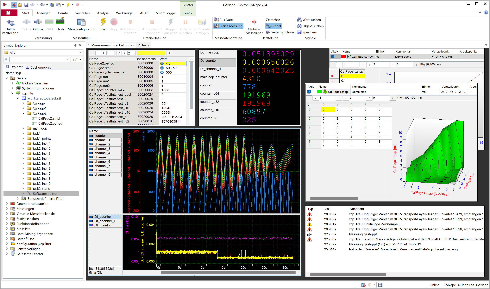

# xcp_lite
XCP for Rust - based on XCPlite  
  
Disclaimer:  
This code is in experimental state. There is no release yet.  
This is no implementation of XCP in Rust, it is an experimental API for measurement and calibration, which uses the ASAM XCP protocol for communication with a measurement and calibration tool like CANape and ASAM A2L for data description. It might support other protocols and data descriptions in the future. 

Main purpose was to experiment with Rust and to demonstrate some more advanced features of measurement and calibration with CANape:
- Automatic A2L and IDL generation with proc-macros
- A thread safe, transparent wrapper for calibration variables which enables offline calibration, calibration page switching, reinit, load and save to file
- Measurement of dynamic data from stack or heap
- Measurement of data with non static lifetime
- Measurement of thread local data instances
- Data objects and containers with dynamic size like point clouds or detection lists, to demonstrate CANape ADAS features
- Support Google protobuf or OMG DDS/CDR serialized data objects with XCP and CANape

Requires CANape 22 SP2.  
The point cloud demo variable is not functional yet.  

## Introduction

XCP is a measurement and calibration protocol commonly used in the automotive industry. It is an ASAM standard.  

It provides real time signal acquisition (measurement) and modification of parameter constants (calibrations) in a target microcontroller system (ECU), to help observing and optimizing control algorithms in real time.  
  
Timestamped events, measurement variables and parameter constants are decribed by an ASAM-A2L description file, another associated ASAM standard. 
Data objects are identified by an address. In a microcontroller system programmed in C or C++, these addresses are used to directly access the ECUs memory, like a debugger would do. This concept has minimum impact on the target system in terms of memory consumption and runtime. The A2l is a kind of annotated ELF Linker-Address-Map, with rich semantic information on data instances and data types.  
In a higher abstraction level programming language, XCP can be treated as a serializer/deserializer, where A2L is the schema, which is generated from the target software data types and instances. Measurement signals and calibration parameters must have static lifetime and a defined memory layout, but no predefined memory location. Data acquisition and modification is achieved by appropriate code instrumentation for measurement and wrapper types for calibration parameters and parameter groups.  

The ASAM-XCP standard defines a protocol and a transport layer. There are transport layers for all common communication busses used in the automotive industry, such as CAN, CAN-FD, FLEXRAY, SPI and Ethernet.  

XCPlite (https://github.com/vectorgrp/XCPlite) is a simplified implementation of XCP in C,C++, optimized for the XCP on Ethernet Transport Layer.  

In C or C++ software, A2L data objects are usually created with global or static variables, which means they have a constant memory address. XCPlite for C++ introduced an additional code instrumentation concept to measure and calibrate instances of classes located on heap. It is still using direct memory access, but A2L addresses are relative and the lifetime of measurement variables is associated to events.

An implementation of XCP in Rust, with direct memory access, will get into conflict with the memory and concurrency safety concepts of Rust. In Rust, mutating static variables by using pointers is considered unsafe code, which might create undefined behaviour in parallel access. Thread safety when accessing any data will be stricly enforced. 

xcp-lite (https://github.com/vectorgrp/xcp-lite) is an implementation of XCP for Rust. It provides a user friendly concept to wrap structs with calibration parameters in a convienient and thread safe type, to make calibration parameters accessible and safely interiour mutable by the XCP client tool. 
To achieve this, the generation of the A2L description is part of the solution. In XCPlite this was an option. 
A2L objects for events and measurement values will be lazily created during startup, using a runtime registry and a proc-macro to create calibration parameter descriptions from structs.

The calibration parameter wrapper type CalSeg enables all advanced calibration features of a measurement and calibration tool like CANape. An instance of CalSeg creates a memory segment, which enables version checking, checksum calculation, offline and indirect calibration, page switching and parameter persistence (freeze and init). It also provides parameter persistence to a json file.  
    
xcp-lite also implements a concept to measure variables on stack or as thread local instances.   

Currently xcp-lite for Rust uses a C library build from XCPlite sources, which contains the XCP server, an ethernet transport layer with its rx/tx server threads, the protocol layer, time stamp generation and time synchronisation. The C implemention is optimized for speed by minimizing copying and locking data. There are no heap allocations. The Rust layer includes the registry and A2L generation, wrapper types for calibration parameters and macros to capture measurement data on events. 

The code should work on Linux, Windows and Mac, Intel and ARM.  
  
The project creates a library crate xcp and a main application to showcase usage. There are more basic examples in the examples folder.  
There is an integration test, where the crate a2lfile is used to verify the generated A2L file and a quick and dirty, tokio based XCP client with hardcoded DAQ decoding for blackbox testing. This includes performance testing which reaches up to 2GByte/s on Linux or MacOS.


## Code instrumentation for measurement and calibration:
  
There are 3 important types: Xcp, XcpEvent and CalSeg.  
Xcp is a wrapper for XCPlite. It is a singleton. There is a builder pattern to initialize the XCP server.   
  
CalSeg is a generic type used to encapsulate structs containing calibration parameters. This is called a calibration segment and the parameter struct wrapped is a calibration page. A calibration page must be Copy and may contain nested structs of basic types.  
  
A CalSeg has interiour mutability. Parameter mutation happens only in the CalSeg::sync(&self) method, which must be repeatedly called by the application code, whenever mutation of calibration parameters is considered ok in the current thread.  
  
A CalSeg may be shared among multiple threads. It it cloned like an Arc, implements the Deref trait for convinience and does not do any locks to deref to the inner calibration parameter page struct. A sync method must be called on each clone, to make new calibration changes visible in each thread. The sync method shares a mutex with all clones. Each clone holds a shadow copy of the calibration values on heap.
      
Measurement code instrumentation provides event definition, registration or capture of measurement objects. Measurement objects can be captured (copied to a buffer inside the event) or accessed directly on stack memory after being registered. Capture works for variables on heap or stack. Measurement variables can be registered as single instance or multi instance, which creates one variaable instance for each thread instance. Variable names and event names are automaticaally extended with an index in this case.

The registration of objects has to be completed, before the A2L file is generated. The A2l is created at latest on connect of the XCP client tool. Objects created later, will not be visible to CANape.  
  
``` rust

// Calibration parameter segment
// Each calibration parameter struct defines a MEMORY_SEGMENT in A2L and CANape
// The A2L serializer will create an A2L CHARACTERISTIC for each field. 
#[derive(Debug, Clone, Copy, Serialize, Deserialize, XcpTypeDescription)]
struct CalPage {

    #[comment = "Amplitude"]
    #[unit = "Volt"]
    #[min = "0"]
    #[max = "400"]
    ampl: f64,

    #[comment = "Period"]
    #[unit = "s"]
    #[min = "0"]
    #[max = "1000"]
    period: f64,
}

// Default calibration page values (called "FLASH" page of a MEMORY_SEGMENT in CANape)
const CAL_PAGE: CalPage = CalPage {
    ampl: 100.0,
    period: 5.0,
};


// A single instance demo task 
// Calculates some measurement signals depending on calibration parameters in a calibration segment
fn task(calseg: CalSeg<CalPage>) {

    let mut channel1: f64 = 0.0;
    let mut channel2: f64 = Box::new(0.0);

     // Create a measurement event called "task" with a capture buffer of 8 byte
    let event = daq_create_event!("task1",8);

    // Register measurement variables on stack
    daq_register!(channel, event, "demo: f64", "Volt" /* unit */, 2.0 /* factor */, 0.0 /* offset */);

    loop {
        thread::sleep(...);

        // Calculate channel depending on calibration parameters from calseg (sine wave signal with ampl and period)
        channel1 = calseg.ampl * (time/cal_seg.period).sin(); // Use active page in calibration segment
        channel2 = calseg.ampl * (time/cal_seg.period).sin(); // Use active page in calibration segment
        
        // Register and capture a variables on heap 
        daq_capture(channel1);

        // Take a timestamp and trigger data acquisition for all variables associated and configured by the tool for this event
        event.trigger(); 

        // Synchronize calibration operations in calseg
        // All calibration actions (read, write, upload, download, checksum, page switch, freeze, init) on segment "cal_seg" happen only here
        // This operation locks a mutex, checks for changes and copies the calibration page
        // It could be called more occationally and in any place where calseg in scope to update calibrations in this clone
        calseg.sync(); 
    }
}


fn main() {

    // Initialize XCP driver singleton, the transport layer UDP and enable the automatic A2L writer and upload
    XcpBuilder::new("xcp_lite").set_log_level(XcpLogLevel::Warn).enable_a2l(true).set_epk("???")
      .start_server(XcpTransportLayer::Udp,[127, 0, 0, 1],5555, 1400,).unwrap();

    // Create a calibration parameter set named "calsseg" (struct CalSeg, a MEMORY_SEGMENT in A2L and CANape)
    // Calibration segments have 2 pages, a constant default "FLASH" page (CAL_PAGE) and a mutable "RAM" page
    // The RAM page can be loaded from a json file (load_json=true)
     let calseg = Xcp::create_calseg(
        "calseg", // name of the calibration segment in A2L as MEMORY_SEGMENT and as .json file
        &CAL_PAGE, // default calibration values
        true,      // load RAM page from file "cal_seg1".json
        );

    // Use CalSeg::Clone() to share the calibration segments between threads
    // No locks, calseg.sync() must be called in each thread
    let c = CalSeg::clone(&calseg)
    thread::spawn(move || {
        task1(c);
    }

    loop { ... }

    Xcp::stop_server();
}


```


## Safety Considerations

The fundamantal functional concept of this XCP implementation is, to mutate the calibration variables in their original binary representation in a thread safe, transparent wrapper type.  
The implementation restricts memory accesses to the inner calibration page of a calibration segment, but does not check the correctness of modifications inside the calibration page. 
As usual, the invariants to consider this safe, include the correctness of the A2L file and of the XCP client tool. When the A2L file is uploaded by the XCP tool on changes, this is always garantueed. 
The wrapper type is Send, not Sync and implements the Deref trait for convinience. This opens the possibility to get aliases to the inner calibration values, which should be avoided. But this will never cause undefined behaviour, as the values will just not get updated, when the XCP tool does a calibration page switch. 

Code in unsafe blocks exists in the following places:

- The implementation of Sync for CalSeg
- All calls to the C FFI of the XCPlite server, which has 9 functions 
- In particular the XCPlite bindings XcpEventExt, ApplXcpRead/WriteMemeory, which transfer a byte pointers to a calibration values. The provenance and length of these pointers are checked.

A completely safe measurement and calibration concept is practically impossible to achieve, without massive consequences for the API, which would lead to much more additional boilerplate code to achive calibration. 
XCP is a very common approach in the automotive industry and there are many tools, HIL systems and loggers supporting it.  
XCP is a development tool, it is not integrated in production code or it is savely disabled.


## Notes

All measurement and calibration code instrumentation is non blocking and the trigger event and sync methods is optimized for speed and minimal locking.  
There are no heap allocation during runtime, except for the lazy registrations of and for A2L generation.
  
build.rs automatically builds a minimum static C library from individially preconfigured core XCPlite sources.   
On C level, there are the usual fast synchronisation mutexes for the mpsc transmit queue.  
The C code starts 2 threads for rx and tx socket handling.

  
The generated A2L file is finalized on XCP connect and provided for upload via XCP.  
This is achieved with a simple A2L writer which uses a template for the A2L.  

The proc macro for more convinient A2L generation is still in an experimantal state.

Measurement of local variables is done with a macro which either copies to a static transfer buffer or directly accesses the value on stack.  
This involves a lazy initialization of the structures to build the A2l file describing the local variables.  

The low word of a calibration parameter (CHARACTERISTIC) memory address in the A2L file is a relative offset in the calibration page struct. The high word is the index of the calibration segment in alphabetic order.  
The memory addresses of local variables are relative addresses in their event capture buffer or to the stack location of the variable holding the event. 
This concept is currently not supported by the A2L update tools, though A2L generation at runtime is the only option.

The EPK version string in the A2L file can be set by the applicaation. It resides a seperate const memory segment.

## Future improvements

- The A2L file should not be loaded to memory when it is provided for upload
- Support more types as calibration parameters, include types for more complex curves and map
- Improve the meta data annotations of the A2L serializer
- Add support for dynamic data objects and variable length lists using the CANape CDR or Protobuf deserializers


## CANape

To use one of the CANape projects included, use 'Project/Open" and select the file CANape.ini in the CANape folder.  

The examples are build with CANape 22 SP2.  
Older versions were not tested.

