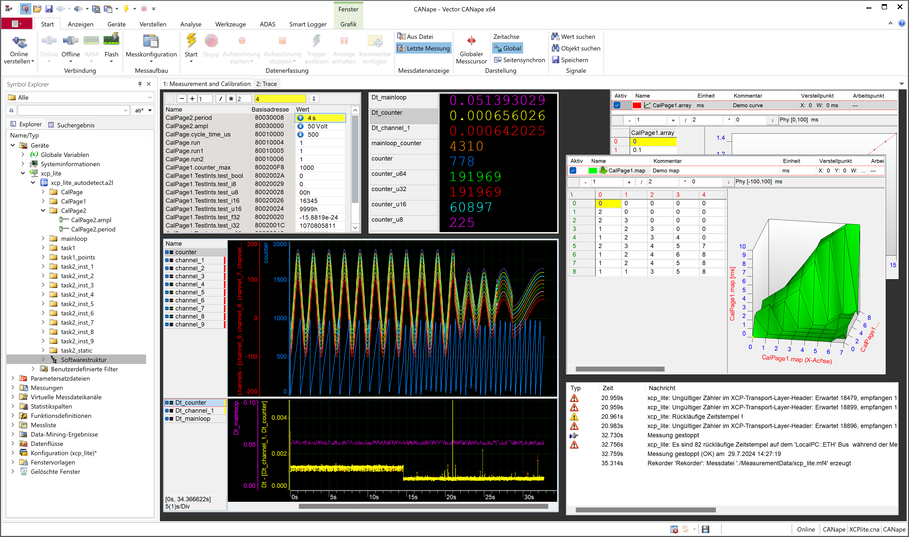

# xcp-lite

XCP for Rust - Rust API for XCPlite (<https://github.com/vectorgrp/XCPlite>)  
  

xcp-lite is a Rust API for measurement and calibration, which uses the ASAM XCP protocol for communication with a measurement and calibration tool like CANape and ASAM A2L for data description.  

This is no complete implementation of XCP in Rust, the protocol and transport layer implementation is in C/C++ based on XCPlite.  
For more details on XCP and XCPlite, see <https://github.com/vectorgrp/XCPlite>.  

Main purpose was to experiment with Rust and to demonstrate some more advanced features of measurement and calibration with CANape:

- Automatic A2L and IDL generation with proc-macros
- A transparent wrapper for calibration variables which provides synchronized and memory safe calibration access
- Support for offline calibration, calibration page switching, reinit, load and save to json file
- Measurement of dynamic variables from stack or heap
- Measurement of variables with non static lifetime
- Measurement of thread local data instances
- Data objects and containers with dynamic size like point clouds or detection lists, to demonstrate CANape ADAS features
- Support Google protobuf or OMG DDS/CDR serialized data objects with XCP and CANape

Requires CANape 22 or later. Example projects are updated to CANape 23.  
  
## Introduction

XCP is a measurement and calibration protocol commonly used in the automotive industry. It is an ASAM standard.  

It provides real time signal acquisition (measurement) and modification of parameter constants (calibrations) in a target micro controller system (ECU), to help observing and optimizing control algorithms in real time.  
  
Timestamped events, measurement variables and parameter constants are described by an ASAM-A2L description file, another associated ASAM standard.
Data objects are identified by an address. In a micro controller system programmed in C or C++, these addresses are used to directly access the ECUs memory, like a debugger would do. This concept has minimum impact on the target system in terms of memory consumption and runtime. The A2l is a kind of annotated ELF Linker-Address-Map, with rich semantic information on data instances and data types.  
In a higher abstraction level programming language, XCP can be treated as a serializer/deserializer, where A2L is the schema, which is generated from the target software data types and instances. Measurement signals and calibration parameters must have static lifetime and a defined memory layout, but no predefined memory location. Data acquisition and modification is achieved by appropriate code instrumentation for measurement and wrapper types for calibration parameters and parameter groups.  

The ASAM-XCP standard defines a protocol and a transport layer. There are transport layers for all common communication busses used in the automotive industry, such as CAN, CAN-FD, FLEXRAY, SPI and Ethernet.  

XCPlite (<https://github.com/vectorgrp/XCPlite>) is a simplified implementation of XCP in C,C++, optimized for the XCP on Ethernet Transport Layer.  

In C or C++ software, A2L data objects are usually created with global or static variables, which means they have a constant memory address. XCPlite for C++ introduced an additional code instrumentation concept to measure and calibrate instances of classes located on heap. It is still using direct memory access, but A2L addresses are relative and the lifetime of measurement variables is associated to events.

An implementation of XCP in Rust, with direct memory access, will get into conflict with the memory and concurrency safety concepts of Rust. In Rust, mutating static variables by using pointers is considered Unsafe code, which might create undefined behavior in parallel access. Thread safety when accessing any data will be strictly enforced.

xcp-lite (<https://github.com/vectorgrp/xcp-lite>) is an implementation of XCP for Rust. It provides a user friendly concept to wrap structs with calibration parameters in a convenient and thread safe type, to make calibration parameters accessible and safely interior mutable by the XCP client tool.
To achieve this, the generation of the A2L description is part of the solution. In XCPlite this was an option.
A2L objects for events and measurement values will be lazily created during startup, using a runtime registry and a proc-macro to create calibration parameter descriptions from structs.

The calibration parameter wrapper type CalSeg enables all advanced calibration features of a measurement and calibration tool like CANape. An instance of CalSeg creates a memory segment, which enables version checking, checksum calculation, offline and indirect calibration, page switching and parameter persistence (freeze and init). It also provides parameter persistence to a json file.  

xcp-lite also implements a concept to measure variables on stack or as thread local instances.

Currently xcp-lite for Rust uses a C library build from XCPlite sources, which contains the XCP server, an ethernet transport layer with its rx/tx server threads, the protocol layer, time stamp generation and time synchronization. The C implementation is optimized for speed by minimizing copying and locking data. There are no heap allocations during runtime. The Rust layer includes the registry and A2L generation, wrapper types for calibration parameters and macros to capture measurement data on events.

The code should work on Linux, Windows and Mac, Intel and ARM.  
  
The project creates a library crate xcp and a set of examples to demonstrate all use cases. An entry level example is hello_xcp in the example folder. There are other, more specific examples in the examples folder.  

There is an integration test, where the crate a2lfile is used to verify the generated A2L file and a quick and dirty, tokio based XCP client with hardcoded DAQ decoding for black box testing.

## Examples  

The crate ships with a set of runnable examples under [examples/](examples/README.md), each paired
with a CANape project. See the [examples overview](examples/README.md) for the full list and the
build, run and command line instructions common to all of them.

## Code instrumentation for measurement and calibration
  
There are 3 important types: Xcp, XcpEvent/DaqEvent and CalSeg.  
Xcp is a wrapper for XCPlite. It is a singleton. There is a builder to initialize the XCP server or ethernet transport layer.
  
CalSeg is a generic type used to encapsulate structs containing calibration parameters. This is called a calibration segment and the parameter struct wrapped is a calibration page. A calibration page must be Copy and may contain nested structs of basic types or arrays with dimension up to 2.  
  
A CalSeg has interior mutability. Parameter mutation happens only on acquiring a calibration segment guard.
  
A CalSeg may be shared among multiple threads. It it cloned like an Arc, implements the Deref trait for convenience and does not do any locks to deref to the inner calibration parameter page struct.

Measurement code instrumentation provides event definition, registration or capture of measurement objects. Measurement objects can be captured (copied to a buffer inside the event) or accessed directly on stack memory after being registered. Capture works for variables on heap or stack. Measurement variables can be registered as single instance or multi instance, which creates one variable instance for each thread instance. Variable names and event names are automatically extended with an index in this case.

The registration of objects has to be completed, before the A2L file is generated. The A2L is created at latest on connect of the XCP client tool. Objects created later, will not be visible to CANape.  
  
## Safety Considerations

The fundamental functional concept of this XCP implementation is, to mutate the calibration variables in their original binary representation in a thread safe, transparent wrapper type.  
The implementation restricts memory accesses to the inner calibration page of a calibration segment, but does not check the correctness of modifications inside the calibration page.
As usual, the invariants to consider this safe, include the correctness of the A2L file and of the XCP client tool. When the A2L file is uploaded by the XCP tool on changes, this is always guaranteed.
The wrapper type is Send, not Sync and implements the Deref trait for convenience. This opens the possibility to get aliases to the inner calibration values, which should be avoided. But this will never cause undefined behavior, as the values will just not get updated, when the XCP tool does a calibration page switch.

Code in Unsafe blocks exists in the following places:

- The implementation of Sync for CalSeg  
- In particular the XCPlite bindings XcpEventExt for measurement and cb_read/cb_write for calibration, which carry byte pointers and memory offsets of measurement and calibration objects  
- And formally all calls to the C FFI of the XCPlite server (optional), transport layer and protocol layer  

A completely safe measurement and calibration concept is practically impossible to achieve, without massive consequences for the API, which would lead to much more additional boilerplate code to achieve calibration.
The memory oriented measurement and calibration approach of XCP is very common in the automotive industry and there are many tools, HIL systems and loggers supporting it.  
XCP is used during the development process only, it is never integrated in production code or it is disabled by save code.

## Build

### Features

Features are:

- a2l_reader
Check A2L file after generation before upload

### Build, Run, Test

Build, Run, Test examples:

```
Build:
  cargo b 
  cargo b --release 
  cargo b --features a2l_reader

Run the main example:
  cargo r -- --bind 127.0.0.1 --log-level 4
  cargo r -- --port 5555 --bind 172.19.11.24 --tcp 
 
Run a specific example:
  cargo r -p struct_measurement_demo
  cargo r -p xcp_client  

```

Test

Tests may not run in parallel, as the XCP implementation is a singleton.
Feature a2l_reader is needed for xcp_client based testing

```
  cargo test --features=a2l_reader  -- --test-threads=1 --nocapture
  cargo test --features=a2l_reader  -- --test-threads=1 --nocapture  --test test_multi_thread
```

Use --nocapture because the debug output from the XCPlite C library is via normal printf

## Notes

Like in C/C++ XCPlite, all measurement and calibration code instrumentation is non blocking and lock-free.
There are no heap allocation during runtime, except for the lazy registrations for A2L generation.
  
build.rs automatically builds a minimum static C library from individually pre configured core XCPlite sources.

The generated A2L file is finalized on XCP connect and provided for upload via XCP.

The proc macro for more convenient A2L generation is still in an experimental state.

Measurement of local variables is done with a macro which either copies to a static transfer buffer in the event or directly accesses the value on stack.  
This involves a lazy initialization of the structures to build the A2l file describing the local variables.  

The EPK version string in the A2L file can be set by the application. It resides a separate, hardcoded const memory segment.  

## CANape

To use one of the CANape projects included, use 'Project/Open" and select the file CANape.ini in the CANape folder.  

The examples are build with CANape 23.
Older versions were not tested.


