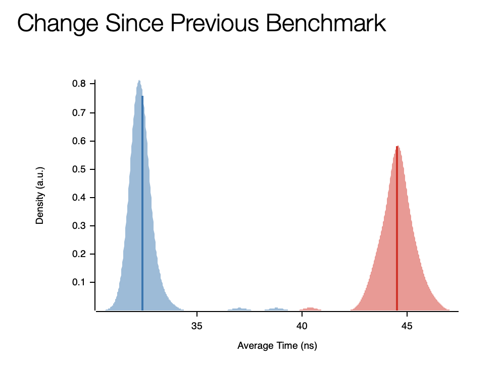
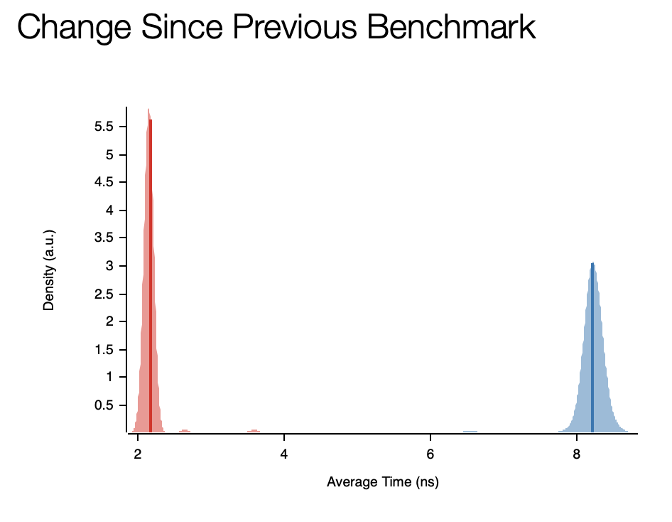

# Benchmarking the 2 performance critical functions DaqEvent::trigger and CalSeg::sync

## DaqEvent::trigger

memcpy versus this:

'''
            if (n==8) {
                *(uint64_t*)d = *(uint64_t*)&base[OdtEntryAddr(e)];
                d += 8;
            }
            else if (n==4) {
                *(uint32_t*)d = *(uint32_t*)&base[OdtEntryAddr(e)];
                d += 4;
            }
            else if (n<4) {
                uint8_t *s = &base[OdtEntryAddr(e)];
                do { *d++ = *s++; } while (--n); 
            } 
            else
            {
                memcpy((uint8_t*)d, &base[OdtEntryAddr(e)], n);
                d += n;
            }
            e++;
'''

## CalSeg::Sync

