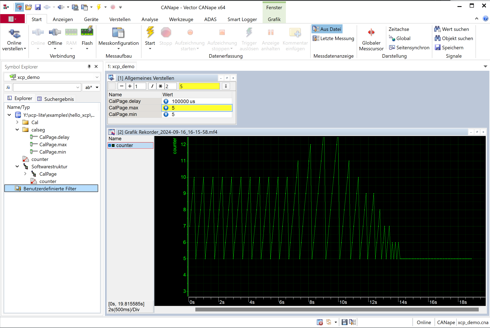

# xcp_lite - hello_xcp

Demonstrates the basic usage of xcp-lite for Rust together with a CANape project.  

See [the examples overview](../README.md) for common build, run and command line instructions.  


## Build and Run:

```sh
cargo r -p hello_xcp

# Write a flattened A2L for tools that don't support typedefs (typedefs expanded into mangled instance names)
cargo r -p hello_xcp -- --flatten
```

## Test

Run the test XCP test client (build from C/C++ XCPlite repo tool sources) in another terminal.  


```sh

# Do a test measurement
# Use generated A2L file (hello_xcp.a2l) in the current directory, file name is detected via XCP
xcpclient --udp --mea "counter" --verbose 2

# Upload A2L file via XCP /to hello_xcp_upload.a2l) and list all calibration parameters and measurements
# Note that xcpclient always flattens and mangles typedefs in the A2L file
xcpclient --udp  --upload-a2l --list-cal '.*' --list-mea ".*"  


# Call for help on the xcpclient command line options
xcpclient --help


```

## CANape

Start CANape with the project file (CANape.ini) in CANape project folder examples/hello_xcp/CANape.  




