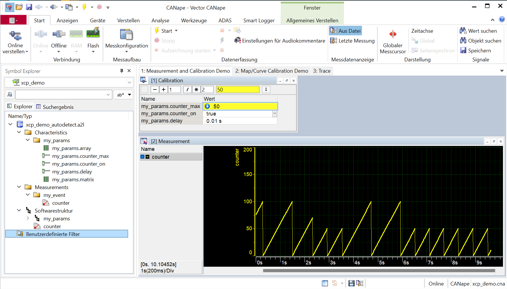

# xcp_lite - hello_xcp

Minimal demo

## CANape

Use CANape to visualize a point cloud 

## A2L file 

The demo creates the A2L file below:

'''

    ASAP2_VERSION 1 71
    /begin PROJECT hello_xcp ""

        /begin HEADER "" VERSION "1.0" /end HEADER
        /begin MODULE hello_xcp ""
    
        /include "XCP_104.aml" 
        
        ...
        
    /begin MOD_PAR ""
    
        EPK "EPK_"
        ADDR_EPK 0x80000000

        /begin MEMORY_SEGMENT
            epk "" DATA FLASH INTERN 0x80000000 4 -1 -1 -1 -1 -1
        /end MEMORY_SEGMENT
     
        /begin MEMORY_SEGMENT
            calseg "" DATA FLASH INTERN 0x80010000 8 -1 -1 -1 -1 -1
            /begin IF_DATA XCP
                /begin SEGMENT /* index: */ 1 /* pages: */ 2 /* ext: */ 0 0 0
                /begin CHECKSUM XCP_ADD_44 MAX_BLOCK_SIZE 0xFFFF EXTERNAL_FUNCTION "" /end CHECKSUM
                /begin PAGE 0x0 ECU_ACCESS_DONT_CARE XCP_READ_ACCESS_DONT_CARE XCP_WRITE_ACCESS_DONT_CARE /end PAGE
                /begin PAGE 0x1 ECU_ACCESS_DONT_CARE XCP_READ_ACCESS_DONT_CARE XCP_WRITE_ACCESS_NOT_ALLOWED /end PAGE
                /end SEGMENT
            /end IF_DATA
        /end MEMORY_SEGMENT

    /end MOD_PAR
    
        /begin IF_DATA XCP
            /begin PROTOCOL_LAYER
            0x104 1000 2000 0 0 0 0 0 252 1468 BYTE_ORDER_MSB_LAST ADDRESS_GRANULARITY_BYTE
            OPTIONAL_CMD GET_COMM_MODE_INFO
            ...
            /end PROTOCOL_LAYER
            /begin DAQ
            DYNAMIC 0 1 0 OPTIMISATION_TYPE_DEFAULT ADDRESS_EXTENSION_FREE IDENTIFICATION_FIELD_TYPE_RELATIVE_BYTE GRANULARITY_ODT_ENTRY_SIZE_DAQ_BYTE 0xF8 OVERLOAD_INDICATION_PID
            /begin TIMESTAMP_SUPPORTED
                0x1 SIZE_DWORD UNIT_1US TIMESTAMP_FIXED
            /end TIMESTAMP_SUPPORTED

            /begin EVENT "mainloop" "mainloop" 0 DAQ 0xFF 0 0 0 CONSISTENCY DAQ /end EVENT

            /end DAQ

            /begin XCP_ON_UDP_IP 0x104 5555 ADDRESS "127.0.0.1" /end XCP_ON_UDP_IP

        /end IF_DATA

        /begin GROUP Cal "" /begin REF_CHARACTERISTIC /end REF_CHARACTERISTIC /end GROUP

        /begin CHARACTERISTIC CalPage.delay "Task delay time in us" VALUE 0x80010000 U32 0 NO_COMPU_METHOD 0 1000000 PHYS_UNIT "us" /end CHARACTERISTIC
        /begin CHARACTERISTIC CalPage.max "Max counter value" VALUE 0x80010004 U16 0 NO_COMPU_METHOD 0 1023 /end CHARACTERISTIC
        /begin CHARACTERISTIC CalPage.min "Min counter value" VALUE 0x80010006 U16 0 NO_COMPU_METHOD 0 1023 /end CHARACTERISTIC
        /begin GROUP calseg "" /begin REF_CHARACTERISTIC CalPage.delay CalPage.max CalPage.min /end REF_CHARACTERISTIC /end GROUP

        /begin MEASUREMENT counter "" UWORD NO_COMPU_METHOD 0 0 0 65535 PHYS_UNIT "" ECU_ADDRESS 0x22 ECU_ADDRESS_EXTENSION 2  
          /begin IF_DATA XCP /begin DAQ_EVENT FIXED_EVENT_LIST EVENT 0 /end DAQ_EVENT /end IF_DATA /end MEASUREMENT

        /end MODULE
    /end PROJECT
    
'''

