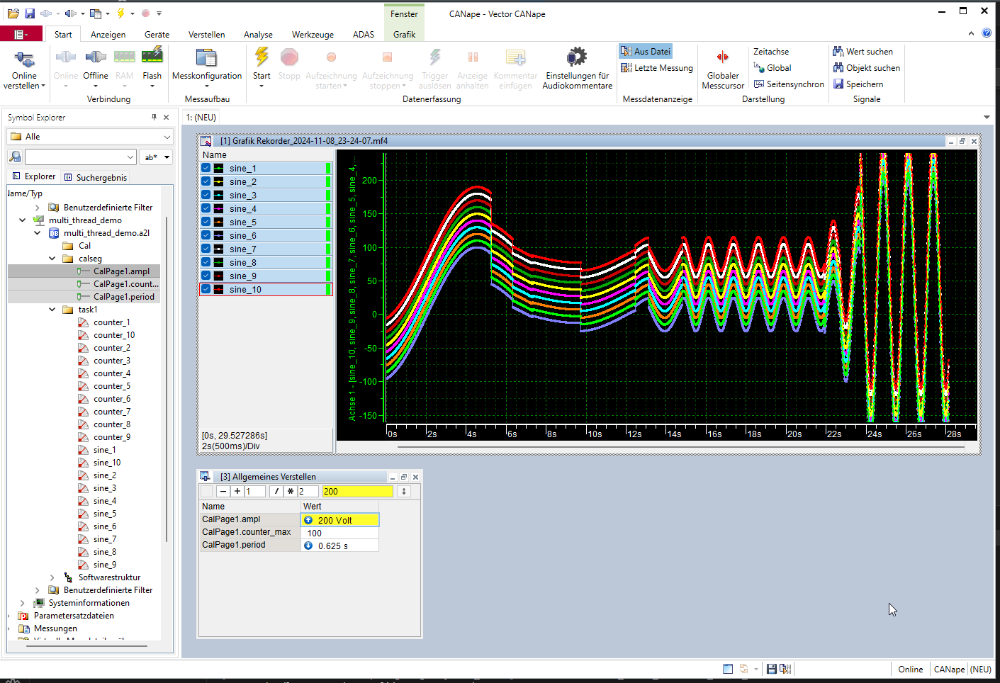

# xcp-lite - Multi thread demo

> See [the examples overview](../README.md) for common build, run and command line instructions.

Demo how to use the xcp crate with in a multi threaded application

