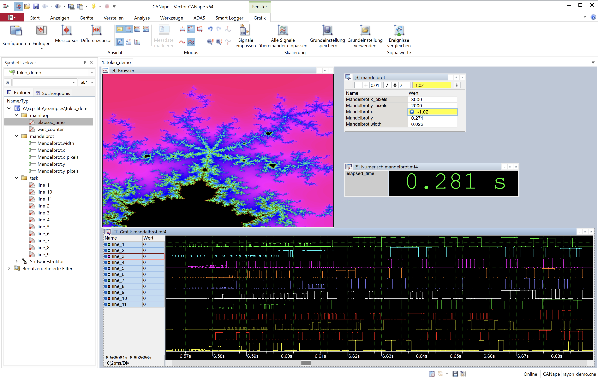

# rayon_demo

> See [the examples overview](../README.md) for common build, run and command line instructions.

Use CANape to visualize start and stop of synchronous tasks in a rayon worker thread pool.  
Taken from the mandelbrot rayon example in the book "Programming Rust" by Jim Blandy and Jason Orendorff.  

Image is recalculated when a parameter is changed.

  
