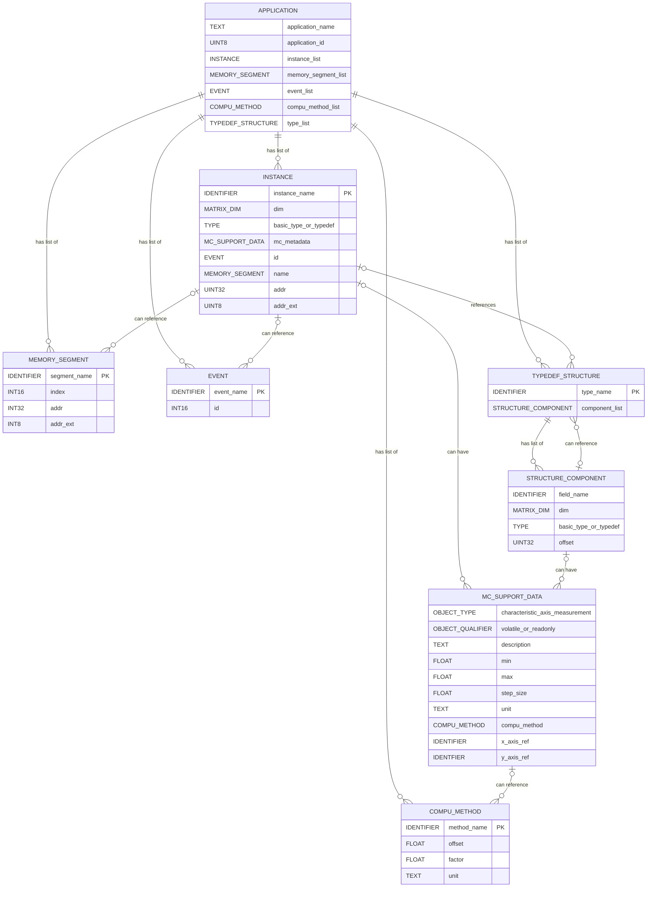

# A2L generation from the SDV datamodel

## Overview how A2L maps to the SDV data model

The following diagram is a simplified overview of the A2L subset, that can be represented with the SDV data model and how things are mapped.  
The primary keys of the SDV data model are equivalent to A2L INSTANCE, MEMORY_SEGMENT, EVENT, TYPEDEF_STRUCTURE and COMPU_METHOD.

There are more COMPU_METHOD types supported. For simplification, this is not shown in detail.  

The field TYPE in STRUCTURE_COMPONENT stands for an enum which may be a basic predefined measurement type like UByte/Uword/Ulong/..., a basic predefined RECORD_LAYOUT for these basic types or a basic predefined TYPEDEF_CHARACTERISTIC/TYPEDEF_MEASUREMENT/TYPEDEF_AXIS, or it may be a reference to another TYPEDEF_STRUCTURE. The A2L generator just creates all these basic predefined objects in the prelude, as well as some predefined COMPU_METHODs such as identity or enum true/false. For an example, see further below.

The A2L generator create INSTANCEs with only a basic predefined typedef as MEASUREMENT, CHARACTERISTIC or AXIS. So this does not need special treatment in the data model.  

Because the hierarchical structure of the SDV data model is a strict tree, where node attributes may only be references to primary keys, serialization and deserialization of the database is very simple. Partial serialization is no problem, it simply must take care that all references to primary keys are included or known.  

The proposed binary representation of the SDV data model defines TYPEDEF_COMPONENTS as another primary key to precisely define serialization of the component list in a typedef. This is not reflected here. In the code first approach of the rust implementation, all container attributes are serialized in the natural code-first way.  

Strings and identifiers might be an additional primary key to simplify serialization of arbitrary length text objects. The binary representation of the SDV data model currently just uses fixed maximal length UTF-8 string slices.

For instances with dynamic size, we use BLOB with a CDR or ProtoBuf IDL schema in the annotation. The annotation is not part of MC_SUPPORT_DATA, instead it is attached to TYPE, because this is the only use for it. In future we could treat this TYPE variant like a TYPEDEF, with the MATRIX_DIMs in the tree pointing out variable length containers in one dimension. The type tree below of a BLOB just annotates the IDL schema with additional meta data. This is not defined and implemented yet. BLOB is currently a leaf in the type hierarchies. Adding this feature, will be a minimal change.  

Another concept not defined yet is, how to deal with optionals in the type tree for an IDL schema.  
Unlimited variable length strings are also not yet defined.  



## Subset of the A2L data model supported by a2l_writer.rs

### Artefacts, namespaces and name mangling

Namespace groups:
xcp-lite: No representation - auto generated
GROUP
All GROUP names are one namespace, regardless of group hierarchies

Namespace measureable or adjustable objects:
xcp-lite: registry::Instance
MEASUREMENT, AXIS_PTS, CHARACTERISTIC, BLOB and INSTANCE

Namespace conversion methods and namespace conversion tables are different
xcp-lite: No representation - factor, offset hardcoded in registry::McSupportData
COMPU_METHOD and COMPU_VTAB

Namespace memory segments
xcp-lite: registry::CalibrationSegment
MEMORY_SEGMENT

Namespace record layouts
xcp-lite: predefined for primitive types
RECORD_LAYOUT

Namespace type definitions
xcp-lite: registry::TypedefComponent registry::Typedef
STRUCTURE_COMPONENT within one TYPEDEF_STRUCTURE
TYPEDEF_STRUCTURE, TYPEDEF_AXIS, TYPEDEF_CHARACTERISTIC, TYPEDEF_MEASUREMENT,

Namespace event
xcp-lite: registry::McEvent:
IFDATA XCP

### INSTANCE of a typedef

```
/begin INSTANCE 
    ident Name
    string Description
    ident TypedefName
    ulong Address
    // @@@@ same as CHARACTERISTIC .....
    [-> MATRIX_DIM] // Creates a multi-dimensional array of TypedefName (layout is assumed to be repr(C) )
    [-> ECU_ADDRESS_EXTENSION]
    [-> IF_DATA]*
    // @@@@ only for INSTANCE .....
    [-> READ_WRITE]   // Marks a measurement instance as writeable
/end INSTANCE
```

### Characteristic typedef and characteristic instance

```

/begin CHARACTERISTIC
    ident Name
    string Description
    enum Type // VALUE, CURVE, MAP, VAL_BLK
    ulong Address // @@@@ only for CHARACTERISTIC
    ident RecordLayout
    float MaxDiff // Always set to 0
    ident Conversion
    float LowerLimit
    float UpperLimit
    [-> AXIS_DESCR]*
    [-> MATRIX_DIM] // Creates a multi-dimensional array of RecordLayout (layout is assumed to be repr(C) )
    [-> PHYS_UNIT]
    [-> STEP_SIZE] // in physical units for CANape +/- buttons
    // @@@@ only for CHARACTERISTIC .....
    [-> ECU_ADDRESS_EXTENSION]
    [-> IF_DATA]*
/end CHARACTERISTIC

/begin TYPEDEF_CHARACTERISTIC
    ident TypeDefName
    string Description
    enum Type // VALUE, CURVE, MAP, VAL_BLK
    ident RecordLayout
    float MaxDiff // Always set to 0
    ident Conversion
    float LowerLimit
    float UpperLimit
    [-> AXIS_DESCR]*
    [-> MATRIX_DIM]
    [-> PHYS_UNIT]
    [-> STEP_SIZE] // in physical units for CANape +/-
/end TYPEDEF_CHARACTERISTIC


// Fixed axis or shared axis description, embedded axis not supported
/begin AXIS_DESCR 
    enum Attribute // Only COM_AXIS and FIX_AXIS implemented
    ident InputQuantity // Always set to NO_INPUT_QUANTITY
    ident Conversion
    uint MaxAxisPoints // Dimension 
    float LowerLimit
    float UpperLimit
    [-> AXIS_PTS_REF] // Name of the axis AXIS_PTS in case of COM_AXIS
    [-> FIX_AXIS_PAR_DIST float Offset float Distance uint Count ] // Fixed axis Offset + n * Dist, not implemented yet, use shared axis instead
    [-> PHYS_UNIT]
    [-> STEP_SIZE]
/end AXIS_DESCR


```

### Measurement typedef and measurement instance

```
/begin MEASUREMENT 
    ident Name
    string Description
    datatype Datatype // UBYTE, UWORD, ...
    ident Conversion
    uint Resolution // set to 1, deprecated
    float Accuracy // set to 0, deprecated
    float LowerLimit
    float UpperLimit
    [-> ECU_ADDRESS]
    [-> MATRIX_DIM] // Creates a multi-dimensional array of DataTyp (layout is assumed to be repr(C) )
    [-> PHYS_UNIT]
    [-> READ_WRITE] // Marks a measurement as writeable
    [-> ECU_ADDRESS_EXTENSION]
    [-> IF_DATA]*
/end MEASUREMENT

/begin TYPEDEF_MEASUREMENT
    ident Name
    string Description
    datatype Datatype // UBYTE, UWORD, ...
    ident Conversion
    uint Resolution // set to 1, deprecated
    float Accuracy // set to 0, deprecated
    float LowerLimit
    float UpperLimit
    [-> MATRIX_DIM]
    [-> PHYS_UNIT]
/end TYPEDEF_MEASUREMENT

```

### Axis instance and axis typedef

```

/begin AXIS_PTS 
    ident Name
    string Description
    ulong Address
    ident InputQuantity // Always set to NO_INPUT_QUANTITY
    ident RecordLayout
    float MaxDiff // Always set to 0
    ident Conversion
    uint MaxAxisPoints // Dimension
    float LowerLimit
    float UpperLimit
    [-> PHYS_UNIT]
    [-> STEP_SIZE]
    [-> ECU_ADDRESS_EXTENSION]
    [-> IF_DATA]*
/end AXIS_PTS

/begin TYPEDEF_AXIS 
    ident Name
    string Description
    ident InputQuantity // Always set to NO_INPUT_QUANTITY
    ident RecordLayout
    float MaxDiff
    ident Conversion
    uint MaxAxisPoints // Dimension
    float LowerLimit
    float UpperLimit
    [-> BYTE_ORDER]
    [-> PHYS_UNIT]
    [-> STEP_SIZE]
/end TYPEDEF_AXIS
```

### TYPEDEF_INSTANCE and TYPEDEF_COMPONENT

```
/begin TYPEDEF_STRUCTURE
    ident Name
    string Description
    ulong Size
    [-> CONSISTENT_EXCHANGE]
    [-> STRUCTURE_COMPONENT]*
/end TYPEDEF_STRUCTURE


/begin STRUCTURE_COMPONENT
    ident Name
    ident TypedefName
    ulong AddressOffset
    [-> MATRIX_DIM]
/end STRUCTURE_COMPONENT

```

### COMPU_METHOD

```

/begin COMPU_METHOD 
    ident Name
    string Description
    enum ConversionType  // Only LINEAR implemented
    string Format // set to .0 for integers and to .3 for floating point
    string Unit
    COEFFS_LINEAR a b
/end COMPU_METHOD

The following methods are predefined for bool and identity of integers

/begin COMPU_METHOD BOOL.conv ""
    TAB_VERB "%.0" "" COMPU_TAB_REF BOOL.conv.table
/end COMPU_METHOD
/begin COMPU_VTAB BOOL.conv.table "" 
    TAB_VERB 2 0 "false" 1 "true"
/end COMPU_VTAB

/begin COMPU_METHOD IDENTITY.conv ""
    IDENTICAL "%.0" "" 
/end COMPU_METHOD

```

### Predefined record layout, type characteristis and typedef_axis

```
            /* Predefined record layouts for standard types */
            /begin RECORD_LAYOUT BOOL FNC_VALUES 1 UBYTE ROW_DIR DIRECT /end RECORD_LAYOUT
            /begin RECORD_LAYOUT U8 FNC_VALUES 1 UBYTE ROW_DIR DIRECT /end RECORD_LAYOUT
            /begin RECORD_LAYOUT S8 FNC_VALUES 1 SBYTE ROW_DIR DIRECT /end RECORD_LAYOUT
            /begin RECORD_LAYOUT U16 FNC_VALUES 1 UWORD ROW_DIR DIRECT /end RECORD_LAYOUT
            /begin RECORD_LAYOUT S16 FNC_VALUES 1 SWORD ROW_DIR DIRECT /end RECORD_LAYOUT
            /begin RECORD_LAYOUT U32 FNC_VALUES 1 ULONG ROW_DIR DIRECT /end RECORD_LAYOUT
            /begin RECORD_LAYOUT S32 FNC_VALUES 1 SLONG ROW_DIR DIRECT /end RECORD_LAYOUT
            /begin RECORD_LAYOUT U64 FNC_VALUES 1 A_UINT64 ROW_DIR DIRECT /end RECORD_LAYOUT
            /begin RECORD_LAYOUT S64 FNC_VALUES 1 A_INT64 ROW_DIR DIRECT /end RECORD_LAYOUT
            /begin RECORD_LAYOUT F32 FNC_VALUES 1 FLOAT32_IEEE ROW_DIR DIRECT /end RECORD_LAYOUT
            /begin RECORD_LAYOUT F64 FNC_VALUES 1 FLOAT64_IEEE ROW_DIR DIRECT /end RECORD_LAYOUT
        
            /* Predefined axix record layouts for standard types */
            /begin RECORD_LAYOUT A_U8 AXIS_PTS_X 1 FLOAT32_IEEE INDEX_INCR DIRECT /end RECORD_LAYOUT
            /begin RECORD_LAYOUT A_S8 AXIS_PTS_X 1 FLOAT32_IEEE INDEX_INCR DIRECT /end RECORD_LAYOUT
            /begin RECORD_LAYOUT A_U16 AXIS_PTS_X 1 FLOAT32_IEEE INDEX_INCR DIRECT /end RECORD_LAYOUT
            /begin RECORD_LAYOUT A_S16 AXIS_PTS_X 1 FLOAT32_IEEE INDEX_INCR DIRECT /end RECORD_LAYOUT
            /begin RECORD_LAYOUT A_U32 AXIS_PTS_X 1 FLOAT32_IEEE INDEX_INCR DIRECT /end RECORD_LAYOUT
            /begin RECORD_LAYOUT A_S32 AXIS_PTS_X 1 FLOAT32_IEEE INDEX_INCR DIRECT /end RECORD_LAYOUT
            /begin RECORD_LAYOUT A_U64 AXIS_PTS_X 1 FLOAT32_IEEE INDEX_INCR DIRECT /end RECORD_LAYOUT
            /begin RECORD_LAYOUT A_S64 AXIS_PTS_X 1 FLOAT32_IEEE INDEX_INCR DIRECT /end RECORD_LAYOUT
            /begin RECORD_LAYOUT A_F32 AXIS_PTS_X 1 FLOAT32_IEEE INDEX_INCR DIRECT /end RECORD_LAYOUT
            /begin RECORD_LAYOUT A_F64 AXIS_PTS_X 1 FLOAT32_IEEE INDEX_INCR DIRECT /end RECORD_LAYOUT

            /* Predefined measurement and characteristic typedefs for standard types */
            /begin TYPEDEF_MEASUREMENT M_F64 "" FLOAT64_IEEE NO_COMPU_METHOD 0 0 -1e12 1e12 /end TYPEDEF_MEASUREMENT
            /begin TYPEDEF_CHARACTERISTIC C_F64 "" VALUE F64 0 NO_COMPU_METHOD -1e12 1e12 /end TYPEDEF_CHARACTERISTIC
            /begin TYPEDEF_MEASUREMENT M_F32 "" FLOAT32_IEEE NO_COMPU_METHOD 0 0 -1e12 1e12 /end TYPEDEF_MEASUREMENT
            /begin TYPEDEF_CHARACTERISTIC C_F32 "" VALUE F32 0 NO_COMPU_METHOD -1e12 1e12 /end TYPEDEF_CHARACTERISTIC
            /begin TYPEDEF_MEASUREMENT M_I64 "" A_INT64 NO_COMPU_METHOD 0 0 -1e12 1e12 /end TYPEDEF_MEASUREMENT
            /begin TYPEDEF_CHARACTERISTIC C_I64 "" VALUE S64 0 NO_COMPU_METHOD -1e12 1e12 /end TYPEDEF_CHARACTERISTIC
            /begin TYPEDEF_MEASUREMENT M_I32 "" SLONG NO_COMPU_METHOD 0 0 -2147483648 2147483647 /end TYPEDEF_MEASUREMENT
            /begin TYPEDEF_CHARACTERISTIC C_I32 "" VALUE S32 0 NO_COMPU_METHOD -2147483648 2147483647 /end TYPEDEF_CHARACTERISTIC
            /begin TYPEDEF_MEASUREMENT M_I16 "" SWORD NO_COMPU_METHOD 0 0 -32768 32767 /end TYPEDEF_MEASUREMENT
            /begin TYPEDEF_CHARACTERISTIC C_I16 "" VALUE S16 0 NO_COMPU_METHOD -32768 32767 /end TYPEDEF_CHARACTERISTIC
            /begin TYPEDEF_MEASUREMENT M_I8 "" SBYTE NO_COMPU_METHOD 0 0 -128 127 /end TYPEDEF_MEASUREMENT
            /begin TYPEDEF_CHARACTERISTIC C_I8 "" VALUE S8 0 NO_COMPU_METHOD -128 127 /end TYPEDEF_CHARACTERISTIC
            /begin TYPEDEF_MEASUREMENT M_U64 "" A_UINT64 NO_COMPU_METHOD 0 0 0 1e12 /end TYPEDEF_MEASUREMENT
            /begin TYPEDEF_CHARACTERISTIC C_U64 "" VALUE U64 0 NO_COMPU_METHOD 0 1e12 /end TYPEDEF_CHARACTERISTIC
            /begin TYPEDEF_MEASUREMENT M_U32 "" ULONG NO_COMPU_METHOD 0 0 0 4294967295 /end TYPEDEF_MEASUREMENT
            /begin TYPEDEF_CHARACTERISTIC C_U32 "" VALUE U32 0 NO_COMPU_METHOD 0 4294967295 /end TYPEDEF_CHARACTERISTIC
            /begin TYPEDEF_MEASUREMENT M_U16 "" UWORD NO_COMPU_METHOD 0 0 0 65535 /end TYPEDEF_MEASUREMENT
            /begin TYPEDEF_CHARACTERISTIC C_U16 "" VALUE U16 0 NO_COMPU_METHOD 0 65535 /end TYPEDEF_CHARACTERISTIC
            /begin TYPEDEF_MEASUREMENT M_U8 "" UBYTE NO_COMPU_METHOD 0 0 0 255 /end TYPEDEF_MEASUREMENT
            /begin TYPEDEF_CHARACTERISTIC C_U8 "" VALUE U8 0 NO_COMPU_METHOD 0 255 /end TYPEDEF_CHARACTERISTIC
            /begin TYPEDEF_MEASUREMENT M_BOOL "" UBYTE BOOL.conv 0 0 0 1 /end TYPEDEF_MEASUREMENT
            /begin TYPEDEF_CHARACTERISTIC C_BOOL "" VALUE U8 0 BOOL.conv 0 1 /end TYPEDEF_CHARACTERISTIC
```

## Equivalenz of INSTANCE versus CHARACTERISTIC, MEASUREMENT and AXIS_PTS

Example for a measurement instance

```
/begin INSTANCE my_name "" typedef_myname 0xADD /end INSTANCE
/begin TYPEDEF_MEASUREMENT typedef_myname "" FLOAT64_IEEE NO_COMPU_METHOD 0 0 -1e12 1e12 /end TYPEDEF_MEASUREMENT
```

is equivalent to

```
/begin MEASUREMENT my_name"" FLOAT64_IEEE NO_COMPU_METHOD 0 0 -1e12 1e12 ECU_ADDRESS 0xADD /end MEASUREMENT
```

So MEASUREMENT, CHARACTERISTIC and AXIS_PTS are no longer needed, just save a few lines in the A2L
But not tried this with CANape yet

## Examples

```

/begin CHARACTERISTIC PUMKF /* name */
    "Pump characteristic map“ /* long identifier */
    MAP /* type */
    0x7140 /* address */
    DAMOS_KF /* deposit */
    100.0 /* maxdiff */
    R_VOLTAGE /* conversion */
    0.0 /* lower limit */
    5000.0 /* upper limit */

    /begin AXIS_DESCR /* description of X-axis points */
        STD_AXIS /* standard axis points */
        N /* reference to input quantity */
        CON_N /* conversion */
        13 /* maximum number of axis points*/
        0.0 /* lower limit */
        5800.0 /* upper limit */
        MAX_GRAD 20.0 /* X-axis: maximum gradient */
    /end AXIS_DESCR

    /begin AXIS_DESCR /* description of Y-axis points */
        STD_AXIS /* standard axis points */
        AMOUNT /* reference to input quantity */
        CON_ME /* conversion */
        17 /* maximum number of axis points*/
        0.0 /* lower limit */
        43.0 /* upper limit */
    /end AXIS_DESCR
/end CHARACTERISTIC


/begin CHARACTERISTIC TORQUE /* name */
    "Torque limitation" /* long identifier */
    CURVE /* type*/
    0x1432 /* address */
    RecordLayoutName /* deposit */
    0.2 /* maxdiff */
    R_TORQUE /* conversion */
    0.0 /* lower limit */
    43.0 /* upper limit */

    /begin AXIS_DESCR /* description of X-axis points */
        COM_AXIS /* common axis points */
        N /* input quantity */
        ConversionRuleName /* conversion */
        14 /* max. no. of axis p.*/
        0.0 /* lower limit */
        5800.0 /* upper limit */
        AXIS_PTS_REF AxisPointsName /* reference to axis points */
    /end AXIS_DESCR

/end CHARACTERISTIC


/* Axis points distribution data record */
/begin AXIS_PTS AxisPointsName /* name */
    "Group axis points speed" /* long identifier */
    0x1032 /* address */
    N /* input quantity */
    RecordLayoutName /* deposit */
    50.0 /* maxdiff */
    ConversionRuleName /* conversion */
    11 /* max. no. of axis points */
    0.0 /* lower limit */
    5800.0 /* upper limit */
/end AXIS_PTS


 /begin CHARACTERISTIC TORQUE /* name */
    "Torque limitation" /* long identifier */
    CURVE /* type*/
    0x1432 /* address */
    RecordLayoutName /* deposit */
    0.2 /* maxdiff */
    R_TORQUE /* conversion */
    0.0 /* lower limit */
    43.0 /* upper limit */

    /begin AXIS_DESCR COM_AXIS /* Opt1: Shared axis */
        NO_INPUT_QUANTITY /* input quantity */
        NO_COMPU_METHOD /* conversion */
        14 /* max. no. of axis p.*/
        0.0 /* lower limit */
        5800.0 /* upper limit */
        AXIS_PTS_REF AxisName /* reference to AXIS_PTS */
   /end AXIS_DESCR

    /begin AXIS_DESCR FIX_AXIS /* Opt2: Fix axis with calculated points */
        NO_INPUT_QUANTITY
        NO_COMPU_METHOD
        {dim} 0 {dim-1} FIX_AXIS_PAR_DIST 0 1 {dim}
    /end AXIS_DESCR

/end CHARACTERISTIC

/begin TYPEDEF_CHARACTERISTIC Name "Comment" VAL_BLK
    RecordLayoutName /* deposit */
    100.0     // maxdiff
    NO_COMPU_METHOD   // no conversion
    10     // lower limit
    65535     // upper limit
    MATRIX_DIM 2 3
/end TYPEDEF_CHARACTERISTIC

/begin AXIS_PTS Name
    "comment"
    0x12345678 /* address */
    NO_INPUT_QUANTITY/* input quantity name */
    RecordLayoutName /* deposit/recordlayout name */
    0 /* maxdiff */
    NO_COMPU_METHOD /* conversion */
    11 /* max. no. of axis points */
    0.0 /* lower limit */
    5800.0 /* upper limit */
/end AXIS_PTS


/begin INSTANCE
    instance_name
    "description of instance"
    type_name // reference to type definition (TYPEDEF_MEASUREMENT, TYPEDEF_STRUCTURE)
    0xC0000094 // address
/end INSTANCE


// Example for MEASUREMENT:
/begin TYPEDEF_STRUCTURE SigGen "" 0x48 // length
    /begin STRUCTURE_COMPONENT field1 typedef_name 0x14 /* offset */ /end STRUCTURE_COMPONENT
    /begin STRUCTURE_COMPONENT field2 typedef_name 0x38 /* offset */ MATRIX_DIM 8 /end STRUCTURE_COMPONENT
/end TYPEDEF_STRUCTURE

// Predefined typedefs M_U8, M_U16, ...
/begin TYPEDEF_MEASUREMENT M_F64 "" FLOAT64_IEEE NO_COMPU_METHOD 0 0 -1e12 1e12 /end TYPEDEF_MEASUREMENT

/begin TYPEDEF_MEASUREMENT
    type_name // type name
    "description"
    UWORD // data type
    conv // conversion method
    1 // resolution
    0 // accuracy
    0 // lower limit
    4294967295 // upper limit
/end TYPEDEF_MEASUREMENT

// Example for CHARACTERISTIC:
/begin TYPEDEF_CHARACTERISTIC
    type_name // type name
    "description"
    VALUE     // object type
    U32   // record layout
    100.0     // maxdiff
    NO_COMPU_METHOD   // no conversion
    10     // lower limit
    65535     // upper limit
/end TYPEDEF_CHARACTERISTIC


```
