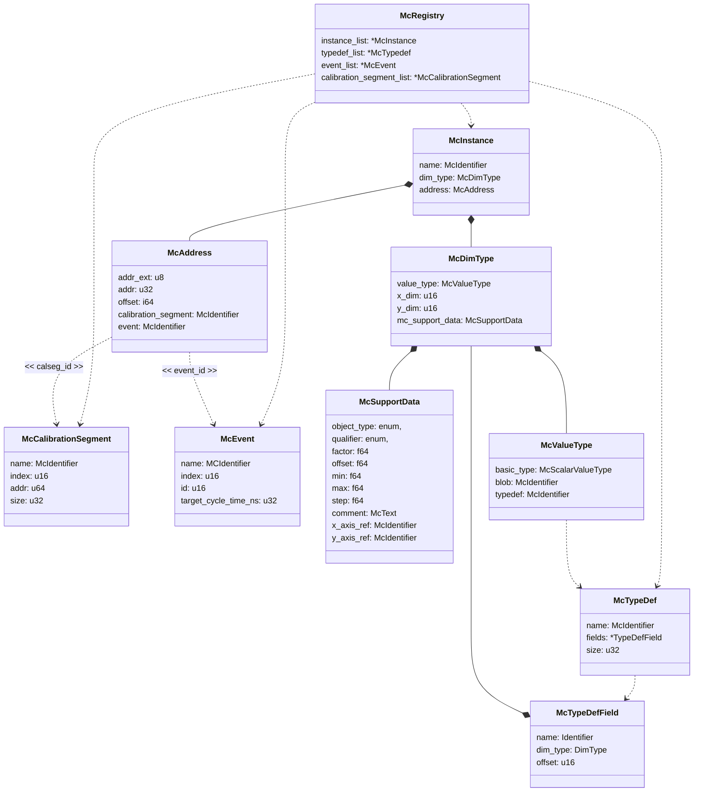

# Registry Data Model

```mermaid
classDiagram

class McRegistry {
    instance_list: *McInstance
    typedef_list: *McTypedef
    event_list: *McEvent
    calibration_segment_list: *McCalibrationSegment
}

class McCalibrationSegment {
    name: McIdentifier
    index: u16
    addr: u64
    size: u32
}

class McEvent {
    name: MCIdentifier
    index: u16
    id: u16
    target_cycle_time_ns: u32
}

class McSupportData {
    object_type: enum,
    qualifier: enum,
    factor: f64
    offset: f64
    min: f64
    max: f64
    step: f64
    comment: McText
    x_axis_ref: McIdentifier
    y_axis_ref: McIdentifier

}

class McInstance {
    name: McIdentifier
    dim_type: McDimType
    address: McAddress
    
}

class McTypeDef {
    name: McIdentifier
    fields: *TypeDefField
    size: u32 
}

class McTypeDefField {
    name: Identifier
    dim_type: DimType      
    offset: u16
}

class McDimType {
    value_type: McValueType
    x_dim: u16
    y_dim: u16
    mc_support_data: McSupportData
}

class McValueType {
    basic_type: McScalarValueType
    blob: McIdentifier
    typedef: McIdentifier
}

class McAddress {
    addr_ext: u8
    addr: u32
    offset: i64
    calibration_segment: McIdentifier 
    event: McIdentifier
}

McRegistry ..> McInstance
McRegistry ..> McTypeDef
McRegistry ..> McEvent
McRegistry ..> McCalibrationSegment

McAddress ..> McCalibrationSegment: << calseg_id >>
McAddress ..> McEvent: << event_id >>

McInstance *-- McDimType
McInstance *-- McAddress

McTypeDef ..> McTypeDefField

McTypeDefField *-- McDimType


McDimType *-- McValueType
McDimType *-- McSupportData

McValueType ..> McTypeDef

```
